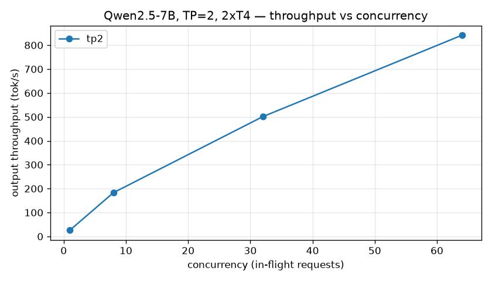

# Result — Continuous batching throughput scaling (Qwen2.5-7B, TP=2, 2×T4)

**Date:** 2026-06-18 · **Serving:** vLLM on Kaggle 2× NVIDIA T4 (16 GB each), `--dtype float16`,
`--tensor-parallel-size 2`, `--gpu-memory-utilization 0.90`, `--max-model-len 8192`.
**Load:** `bench/benchmark.py`, streaming, `max_tokens=128`, driven from a MacBook Air over a
cloudflared tunnel.

## Method
Fixed the model and TP, swept client concurrency (in-flight requests) and measured aggregate output
throughput plus per-request TTFT / TPOT.

## Data
| concurrency | throughput (tok/s) | TTFT p50 (s) | TTFT p99 (s) | TPOT p50 (s) | failed |
|---|---|---|---|---|---|
| 1  | 26.3  | 0.233 | 1.044 | 0.0337 | 0 |
| 8  | 183.2 | 0.389 | 0.891 | 0.0375 | 0 |
| 32 | 501.0 | 0.619 | 1.818 | 0.0529 | 0 |
| 64 | 841.4 | 0.480 | 1.738 | 0.0620 | 0 |

## Interpretation
- **Throughput scaled ~32×** (26 → 841 tok/s) from concurrency 1 → 64. A single stream barely uses the
  GPUs; vLLM's **continuous batching** packs many sequences into each decode step, so tok/s climbs
  steeply with load. This is the core reason batched serving exists.
- **TPOT rose only 34 → 62 ms** across that range — each *individual* user's tokens slowed <2×, while
  total work rose 32×. That gap is the batching win: throughput scales far faster than per-token latency.
- **No saturation cliff yet.** Throughput was still rising at c=64 and TTFT p99 stayed <2 s with zero
  failures — the KV cache never filled at this `--max-model-len` / util. To see paged-attention
  saturation (queueing + preemption + a TTFT cliff), the next run lowers `--gpu-memory-utilization`
  and pushes concurrency higher — that's [experiment 03](../../experiments/03_paged_attention_kv_cache).

## Caveat
These 2×T4s are PCIe (no NVLink), so the tensor-parallel all-reduce runs over a slower interconnect —
relevant when we isolate the TP=1 vs TP=2 comparison in
[experiment 01](../../experiments/01_tensor_parallelism).
